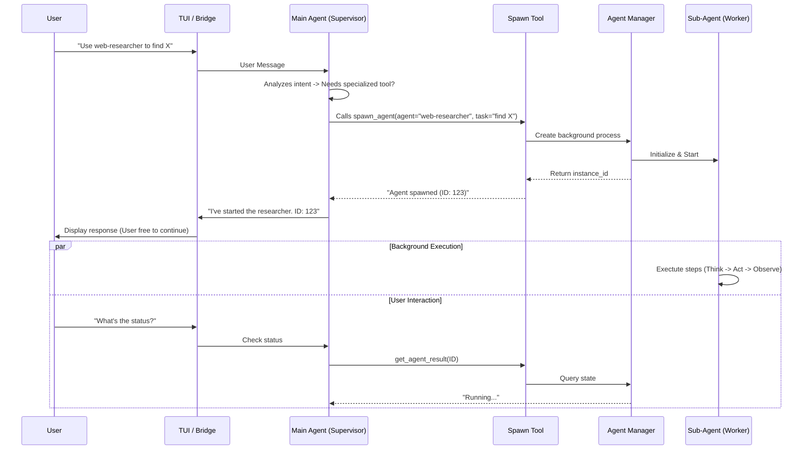

# Parallel Agent Architecture & Workflow

This document outlines the architecture for the ReACTOR parallel agent system, detailing how users interact with agents, how the main agent spawns background workers, and what components handle the execution.

## 1. High-Level Workflow

The system uses a **Supervisor-Worker** model where the Main Agent (which you chat with) acts as a router and supervisor for specialized sub-agents.

## 2. Components Status

### ✅ Implemented Components

1.  **Agent Definition System** (`.reactor/agents/`)
    *   Markdown-based configuration
    *   Defines system prompts, preferred tools, and descriptions
2.  **Tooling** (`src/tools/agent_tools.py`)
    *   `spawn_agent`: The interface for the Main Agent to start workers
    *   `get_agent_result`: For checking status/results
    *   `list_available_agents`: discovery
3.  **TUI Integration**
    *   Agents are just tools to the Main Agent, so no special TUI parsing logic is needed
    *   Bridge passes user text directly to Main Agent

### 🚧 Missing / Planned Components

1.  **Agent Manager Backend** (`src/agents/manager.py`)
    *   **CRITICAL MISSING PIECE**
    *   Needs to handle:
        *   Creating isolated execution environments (threads or async tasks)
        *   Managing state (running, completed, error)
        *   Storing logs and results
2.  **Agent Instance Wrapper**
    *   The actual worker loop that mimics `src/nodes/agent_nodes.py` but runs autonomously
3.  **Persistence**
    *   Currently, if you restart the app, background agents die. Need SQLite or file-based usage for persistence (future scope)

## 3. Detailed Data Flow

### Step 1: User Request [TUI Layer]
*   **Input**: User types `"Can you ask the code-reviewer to check src/main.py?"`
*   **Bridge**: No special parsing. Sends text to Main Agent.

### Step 2: Supervisor Decision [Main Agent Layer]
*   **Context**: Main Agent sees `spawn_agent` in its tool definition.
*   **Reasoning**: "User wants specialized code review. I should use the `spawn_agent` tool."
*   **Action**: Generates tool call: `spawn_agent(agent_name="code-reviewer", task="check src/main.py")`

### Step 3: Spawning [Tool Layer]
*   **Validation**: `agent_tools.py` checks if `code-reviewer` exists in loaded agents.
*   **Execution**:
    *   Loads `code-reviewer` configuration from file.
    *   Calls `AgentManager.spawn(...)` (The missing backend).
*   **Return**: Returns a unique `instance_id` string to the Main Agent.

### Step 4: Background Execution [Manager Layer]
*   **Agent Instance**:
    *   Initialized with `system_prompt` from the agent file.
    *   Initialized with `preferred_tools` (e.g., `read_file`, `grep`).
    *   **Loop**: Runs the standard LangGraph cycle defined in `src/graph.py`:
        1.  **Thinking Node**: Analyzes intent and plans
        2.  **Agent Node**: Generates tool calls or final response
        3.  **Tool Node**: Executes requested tools (if any)
        4.  **Loop Back**: Returns to Thinking node to analyze tool results
        *   *(Cycle continues until Agent Node produces text without tools)*
*   **State Updates**: Continuously updates its status in the Manager (Running -> Completed).

### Step 5: Result Retrieval
*   **Polling**: Main Agent (or User) checks status via `get_agent_result(id)`.
*   **Completion**: When Sub-Agent finishes, it produces a final answer.
*   **Handoff**: Main Agent reads final answer and summarizes it for the User.

## 4. How to Use (Current State)

Since the `AgentManager` backend is not yet implemented, the `spawn_agent` tool will currently fail (or mock success). To make this fully functional, we need to implement the backend logic that actually runs the agent loop in a separate `asyncio.Task`.
