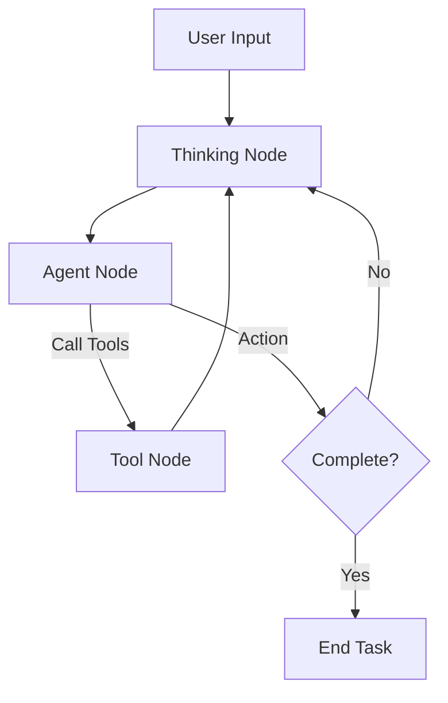

# ReACTOR - Technical Documentation

## Project Overview

**ReACTOR** is an intelligent, LLM-powered shell automation tool that bridges the gap between natural language and command-line operations. Unlike traditional shell assistants that simply execute commands, this agent features a **dual-mode architecture** that can both analyze your projects intelligently and execute tasks safely.

### Vision

Enable developers to interact with their codebase and system using natural language, with an AI assistant that:
- Understands context without executing destructive commands
- Communicates plans before taking action
- Provides intelligent insights about project structure and code
- Executes tasks safely with human oversight

---

## Current Status (v0.2.0)

### Development Timeline

**Phase 1: Foundation (Completed)**
- Basic LangGraph workflow with command execution
- Shell tool integration
- Simple TUI interface

**Phase 2: Conversational Agent (Completed)** ✅
- Upfront communication nodes
- Plan presentation before execution
- Live progress streaming
- Special message formatting

**Phase 3: Dual-Mode Architecture (Completed)** ✅
- File reading tools (non-shell-based)
- Analytical workflow for project understanding
- Intent-based routing between analysis and execution
- LLM-powered code analysis

**Phase 4: Polish & Optimization (Current)**
- Parallel execution implementation
- Enhanced error handling
- Performance optimization

### Feature Status

#### ✅ Fully Implemented

**Analytical Capabilities**
- File discovery with categorization
- Safe file reading (text files, respects size limits)
- Project structure detection (Python, Node.js, Rust, etc.)
- LLM-based code analysis and summarization
- No shell commands for analysis tasks

**Execution Capabilities**
- Intent parsing with category detection
- Multi-command plan generation
- Safety validation (3-tier risk system)
- Auto-approval for safe commands
- Human-in-the-loop for dangerous operations
- Configurable retry mechanism (default: 3 attempts)
- LLM-powered error analysis

**User Interface**
- 3-column cyberpunk TUI layout
- File explorer sidebar
- Agent conversation panel
- Execution plan tree view
- Live output display
- Results table
- Execution mode toggle button
- Status bar with mode display
- Color-coded messages with emojis

**State Management**
- Thread-based conversation persistence
- Execution mode (sequential/parallel)
- Retry count tracking
- Analysis data storage
- Approval workflow state

#### 🚧 Partially Implemented

**Parallel Execution**
- UI toggle exists and updates state ✅
- State field `execution_mode` available ✅
- Graph routing logic incomplete ⚠️
- Need asyncio.gather() for concurrent commands ⚠️
- Risk: commands may have dependencies ⚠️

**Conversation History**
- Messages stored in LangGraph state ✅
- Thread ID-based sessions ✅
- No persistent storage across app restarts ❌
- No conversation export ❌

#### 📋 Planned

**Advanced Analysis**
- Semantic code search
- Dependency graph visualization
- Git diff analysis
- Code quality metrics
- Architecture diagrams

**Enhanced Execution**
- Multi-step task decomposition
- Conditional execution (if/else in plans)
- Background job management
- Execution scheduling

**Developer Tools**
- Plugin system for custom tools
- API mode (use agent programmatically)
- Notebook integration
- VSCode extension

---

## Architecture Deep Dive

### Workflow Graph

The agent uses a reliable **Thinking-Agent Loop** implemented in LangGraph:



### Core Design Philosophy

1. **Thinking (Brain)**: A pure reasoning node that analyzes the state, context, and previous tool outputs. It does NOT call tools. It produces a natural language "thought" or "plan".
2. **Agent (Hands)**: An execution node that interprets the plan and selects the appropriate tools. It is the only node allowed to trigger actions.
3. **Tools (Action)**: The actual execution layer (Shell, File I/O, Web).

### Node Types

#### **Thinking Node** (`src/nodes/thinking_nodes.py`)
- *Role*: Strategic Planner
- *Input*: Conversation history, System Info
- *Output*: Reasoning text (visible in TUI as "Thinking")
- *Behavior*: Analyzes results, checks for errors, decides next step.

#### **Agent Node** (`src/graph_simple.py`)
- *Role*: Tactical Executor
- *Input*: Thinking output
- *Output*: Tool Calls OR Final Summary
- *Behavior*: Translates high-level thoughts into specific tool parameters.

#### **Tool Node**
- *Role*: System Interactor
- *Input*: Tool calls
- *Output*: Tool artifacts (stdout, file content, search results)

---

## Tool System

### Shell Tools (`src/tools/shell_tools.py`)

**`get_system_info`**
- Detects OS (Windows/Mac/Linux)
- Identifies shell (PowerShell/Bash/Zsh)
- Gets working directory
- Checks permissions

**`execute_shell_command`**
- Runs commands with timeout
- Captures stdout/stderr
- Tracks duration
- Supports dry-run mode

**`validate_command_safety`**
- Analyzes command syntax
- Checks for destructive patterns (rm, chmod, etc.)
- Returns risk level (safe/moderate/dangerous)
- Lists potential warnings

### File Tools (`src/tools/file_tools.py`)

**`list_project_files`**
- Recursive directory traversal (max depth: 3)
- Respects .gitignore-style patterns
- Categories files by extension
- Limits output for performance

**`read_file_content`**
- Safe text file reading
- Size limit: 1MB
- Line limit: 500
- UTF-8 encoding with fallback

**`analyze_project_structure`**
- Detects project type from config files
- Finds README files
- Identifies entry points
- Checks for Git repository

---

## UI Components

### Widget Hierarchy

```
ShellAgentTUI
├── Header (title bar)
├── Container#main-layout
│   ├── Vertical#col-files (left)
│   │   ├── Static (panel header)
│   │   └── FileExplorer
│   ├── Vertical#col-agent (center)
│   │   ├── Horizontal#dashboard-header
│   │   │   ├── StateIndicator
│   │   │   └── Button#mode-toggle
│   │   ├── LogViewer#log-viewer
│   │   └── Container#input-container
│   │       └── Input#agent-input
│   └── Vertical#col-context (right)
│       ├── CodeViewer
│       ├── LiveExecutionPanel
│       ├── ExecutionPlanDisplay
│       └── ResultsPanel
└── StatusBar (footer)
```

### Message Formatting

LogViewer applies special styling based on message prefix:

| Prefix | Title | Border Color | Use Case |
|--------|-------|--------------|----------|
| 💡 | 🧠 Understanding | Gold | Intent explanation |
| 🛠️ | Activity | Default | Tool Usage / File Ops |
| ⚡ | ⚡ Progress | Green | Execution updates |
| 💬 | User | Purple | User messages |
| - | Thinking | Slate Blue | Reasoning (Thinking Node) |
| - | Agent | Cyan | Agent responses |
| - | Error | Red | Error messages |

---

## Configuration

### Environment Variables

```env
# LLM Provider
LLM_PROVIDER=anthropic              # or openai
LLM_MODEL=claude-sonnet-4-20250514 # or gpt-4, etc.

# API Keys
ANTHROPIC_API_KEY=sk-ant-...
OPENAI_API_KEY=sk-...

# Optional: Logging
LOG_LEVEL=INFO                      # DEBUG, INFO, WARNING, ERROR
```

### State Configuration

Configurable via initial state or runtime updates:
- `execution_mode`: "sequential" (default) or "parallel"
- `max_retries`: 3 (default), range 1-10
- Ignored in analytical flow

### Safety Configuration

Risk levels defined in `src/tools/shell_tools.py`:

```python
DANGEROUS_PATTERNS = [
    r'\brm\b',              # Remove files
    r'\bchmod\b',           # Change permissions
    r'\bsudo\b',            # Elevated privileges
    r'\bcurl\s+.*\|\s*sh',  # Pipe to shell
    # ... more patterns
]
```

---

## Performance Considerations

### File Analysis Limits

**Discovery**:
- Max depth: 3 levels
- Ignores: node_modules, .git, __pycache__, dist, build
- Returns first 100 files in flat list

**Reading**:
- Max files per analysis: 10
- Max file size: 1MB
- Max lines per file: 500 (truncates larger files)
- Encoding: UTF-8 (skips binary files)

**LLM Context**:
- File contents truncated to 1000 chars for analysis
- Total context window depends on model
- Consider token limits when analyzing large codebases

### Execution Performance

**Shell Commands**:
- Default timeout: 30 seconds
- Async execution (doesn't block TUI)
- Streams output incrementally

**State Checkpointing**:
- Uses MemorySaver (in-memory checkpoints)
- Not persistent across app restarts
- Consider SQLite checkpointer for production

---

## Development Roadmap

### Q1 2025
- [ ] Finish parallel execution implementation
- [ ] Add conversation persistence (SQLite)
- [ ] Implement semantic code search
- [ ] Create plugin system architecture

### Q2 2025
- [ ] Multi-llm support (local models)
- [ ] VSCode extension
- [ ] API server mode
- [ ] Docker support

### Q3 2025
- [ ] Advanced analytics (code metrics, complexity)
- [ ] Git workflow integration
- [ ] Automated testing generation
- [ ] Documentation generation

### Q4 2025
- [ ] Enterprise features (audit logs, role-based access)
- [ ] Cloud deployment options
- [ ] Performance optimization
- [ ] Production hardening

---

## Known Issues & Limitations

### Current Limitations

1. **No Parallel Execution**: UI toggle exists but actual parallel command execution not implemented
2. **No Persistent History**: Conversations lost on app restart
3. **Limited File Analysis**: Only reads first 10 files, 500 lines each
4. **No Streaming Tokens**: LLM responses arrive in full, not token-by-token
5. **Windows Focus**: Primarily tested on Windows (PowerShell)

### Known Bugs

1. Graph PNG generation may fail if mermaid.ink API is unreachable (non-blocking)
2. Occasional TUI rendering glitches on rapid message updates
3. File discovery may be slow on very large projects (>10k files)

### Future Improvements

1. Incremental file analysis (remember previous analyses)
2. Streaming LLM responses for better UX
3. Background workers for long-running tasks
4. Better error messages with troubleshooting hints

---

## Technical Decisions

### Why LangGraph?
- Built-in state management and checkpointing
- Conditional routing between workflow paths
- Easy to visualize and debug
- Integrates seamlessly with LangChain tools

### Why Textual?
- Rich, terminal-based UI without browser overhead
- Cross-platform compatibility
- Reactive programming model
- Beautiful out-of-the-box widgets

### Why Dual-Mode Architecture?
- Analysis tasks shouldn't execute commands
- Separation of concerns (understanding vs doing)
- Different tool requirements (file readers vs shell executors)
- Better safety (read-only analysis can't harm system)

---

## Contributing Guidelines

### Code Style
- Python 3.10+ type hints
- Pydantic for data validation
- Async/await for I/O operations
- Docstrings for all public functions

### Testing
- Unit tests for tools and nodes
- Integration tests for workflows
- Manual TUI testing required (no automated UI tests yet)

### Git Workflow
1. Fork and create feature branch
2. Make changes with clear commit messages
3. Test locally (poetry run python main.py)
4. Submit PR with description

---

## Appendix

### Glossary

- **LLM**: Large Language Model (Claude, GPT-4)
- **LangGraph**: Framework for building stateful agent workflows
- **TUI**: Terminal User Interface
- **Node**: A step in the LangGraph workflow
- **Tool**: A function the agent can call (shell execution, file reading)
- **State**: The data structure passed between nodes
- **Intent**: Parsed understanding of user request

### References

- [LangChain Documentation](https://docs.langchain.com/)
- [LangGraph Tutorial](https://langchain-ai.github.io/langgraph/)
- [Textual Documentation](https://textual.textualize.io/)
- [Anthropic Claude API](https://docs.anthropic.com/)

---

**Last Updated**: December 6, 2024  
**Version**: 0.2.0  
**Maintainer**: Your Name
