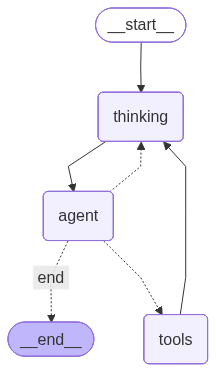

# ReACTOR

[](https://opensource.org/licenses/MIT)
[](https://www.python.org/downloads/)
[](https://github.com/psf/black)

An intelligent, conversational shell automation agent powered by LLMs (Large Language Models) with a beautiful Textual TUI interface and **automatic AST analysis**.

## 🌟 Overview

ReACTOR is a **dual-mode AI assistant** that can both:
1. **Analyze Projects** - Intelligently read and understand your codebase without executing commands
2. **Execute Tasks** - Generate and run shell commands safely with human-in-the-loop approval
3. **🔄 Automatic Code Analysis** - Built-in reactor system provides real-time AST validation and feedback

The agent features a **conversational interface** that communicates its understanding and plans *before* taking action, not after.

## ✨ Key Features

### 🧠 Dual-Mode Intelligence
- **Analytical Mode**: Reads files, analyzes project structure, provides intelligent summaries
- **Execution Mode**: Generates shell commands, validates safety, executes with approval
- **🔄 Reactor Integration**: Automatic AST analysis on every file operation

### 💬 Conversational Interface
- **Upfront Communication**: Agent explains what it understood before acting
- **Plan Preview**: Shows execution plan before running any commands
- **Live Progress**: Streams results as each command executes
- **Retry Visibility**: Shows error analysis and retry attempts in real-time

### 🎛️ Advanced Controls
- **Execution Mode Toggle**: Switch between Sequential (⏩) and Parallel (⚡) execution
- **Auto-approval**: Safe commands execute automatically (configurable)
- **Configurable Retries**: Set max retry attempts per task
- **Safety Validation**: Commands are analyzed for risk before execution

### 🔄 Reactor System - "Simple Actions, Smart Reactions"
ReACTOR includes an **automatic AST analysis layer** that provides intelligent feedback on all file operations:

#### **For AI Agents:**
- **Simple Operations Only**: Just read/write text files - no AST knowledge needed
- **Automatic Validation**: Every file is automatically parsed and validated
- **Smart Feedback**: Get syntax, import, and dependency analysis instantly
- **Error Prevention**: Catch issues before they cause problems

#### **Key Reactor Features:**
- ✅ **Syntax Validation**: Real-time syntax checking with detailed error reporting
- ✅ **Import Analysis**: Validates imports and detects missing modules
- ✅ **Dependency Tracking**: Maps file dependencies and affected files
- ✅ **Breaking Change Detection**: Identifies API changes that might break other code
- ✅ **Auto-Fixes**: Automatically adds missing imports and fixes formatting
- ✅ **Impact Assessment**: Analyzes how changes affect the broader codebase

#### **Example Reactor Feedback:**
```json
{
  "status": "success",
  "validation": {
    "syntax": "valid",
    "imports": "valid"
  },
  "impact": {
    "level": "minimal",
    "affected_files": []
  },
  "auto_fixes": {
    "applied": ["Added missing import: typing.Optional"],
    "count": 1
  },
  "suggestions": [
    "✓ Code looks good - no issues detected"
  ]
}
```

#### **Error Handling Examples:**
- **Syntax Errors**: Reactor detects and blocks auto-fixes, returns detailed error messages
- **Import Issues**: Automatically adds missing imports, removes unused ones
- **Breaking Changes**: Identifies affected files and provides impact analysis
- **Style Issues**: Applies formatting fixes and suggests improvements

### 🎨 Cyberpunk TUI
- Beautiful 3-column layout with neon aesthetics
- File explorer, agent chat, and execution panels
- Color-coded messages with special formatting
- Real-time execution output and results

## 🚀 Getting Started

### Prerequisites

- Python 3.10+
- pip

### Installation

You can install ReACTOR directly using pip:

```bash
pip install git+https://github.com/faisalahmedsifat/reactor
```

### Initialization

Initialize the project by selecting your model, provider, and API key:

```bash
reactor --model <model_name> --provider <provider_name> --api-key <your_api_key>
```

Example:
```bash
reactor --model claude-3-5-sonnet-latest --provider anthropic --api-key sk-ant-...
```

### Run

Start the agent:

```bash
reactor
```

```

## 🧩 Customization

Extend ReACTOR with custom agents and skills:

- **Agents**: Specialized personas (e.g., SEO Expert, Data Analyst)
- **Skills**: Reusable knowledge modules (e.g., React Best Practices, API Design)

[**📚 Guide: Creating Agents and Skills**](docs/CREATING_AGENTS_AND_SKILLS.md)

## 📖 Usage

### Analytical Tasks

Ask the agent to analyze or understand:

```
"analyze this project"
"what does this codebase do?"
"explain the project structure"
"review the code and suggest improvements"
```

**Agent will**:
- 🔍 Discover all project files
- 📖 Read README, config files, and source code
- 💭 Provide intelligent analysis using LLM
- ❌ **No shell commands executed**

### Execution Tasks

Ask the agent to do something:

```
"create a new Python file called test.py"
"install pytest"
"list files in current directory"
"create a venv and install dependencies"
```

**Agent will**:
- 💡 Explain what it understood
- 📋 Show execution plan with risk levels
- ⚡ Execute commands (with approval for dangerous ones)
- ✅ Stream progress as work completes

### 🔄 Reactor-Enhanced File Operations

When agents create or modify files, the reactor system automatically provides analysis:

```bash
# Agent creates file - reactor automatically analyzes
reactor -p "Create a Python file with imports and a class"

# Response includes reactor feedback:
{
  "file": "example.py",
  "validation": {"syntax": "valid", "imports": "valid"},
  "reactor_feedback": {
    "auto_fixes": {"applied": ["Added missing import: typing.Optional"]},
    "suggestions": ["✓ Code looks good - no issues detected"]
  }
}
```

**Reactor Features:**
- ✅ **Automatic Syntax Validation** - Catches errors instantly
- ✅ **Import Analysis** - Detects missing/unused imports
- ✅ **Dependency Tracking** - Maps file relationships
- ✅ **Breaking Change Detection** - Identifies API changes
- ✅ **Auto-Fixes** - Adds missing imports, fixes formatting
- ✅ **Smart Feedback** - Actionable suggestions for every issue

### 🔄 Reactor System Integration

The reactor subsystem can be configured via `reactor_config.yaml`:

## 🏗️ Architecture

### Workflow Overview


### Key Components
- **LangGraph Workflow**: simplified ReAct-style loop with specialized nodes
- **Thinking Node**: Pure reasoning engine that analyzes state and plans next steps
- **Agent Node**: Execution unit that selects tools or summarizes results
- **Tool Node**: Handles safe execution of shell and file operations
- **Textual TUI**: "Powerhouse" interface with real-time thought visibility
- **🔄 Reactor System**: Automatic AST analysis and validation layer

### Technology Stack
- **LangChain & LangGraph**: Agent orchestration framework
- **Textual**: Terminal User Interface framework
- **Pydantic**: Data validation and models
- **Poetry**: Dependency management
- **Claude/OpenAI**: LLM providers
- **AST Parsers**: Multi-language code analysis (Python, JavaScript, Java, Go, Rust, etc.)

## 📁 Project Structure

```
reactive-shell-agent/
├── src/
│   ├── graph.py                 # LangGraph workflow definition
│   ├── state.py                 # Agent state management
│   ├── models.py                # Pydantic models
│   ├── nodes/
│   │   ├── llm_nodes.py        # LLM reasoning nodes
│   │   ├── communication_nodes.py  # Upfront communication
│   │   ├── analysis_nodes.py   # File analysis workflow
│   │   ├── approval_nodes.py   # Human-in-the-loop approval
│   │   └── refinement_nodes.py # Command refinement
│   ├── tools/
│   │   ├── shell_tools.py      # Shell command execution
│   │   └── file_tools.py       # File reading & analysis
│   ├── tui/
│   │   ├── app.py              # Main TUI application
│   │   ├── bridge.py           # LangGraph ↔ TUI bridge
│   │   ├── state.py            # TUI state management
│   │   ├── styles.tcss         # Cyberpunk styling
│   │   └── widgets/            # Custom TUI widgets
│   └── llm/
│       └── factory.py          # LLM client factory
├── main.py                      # Entry point
├── pyproject.toml              # Poetry configuration
└── README.md                   # This file
```

## 🔧 Configuration

### Execution Modes

Use the toggle button in the TUI:
- **⏩ Sequential**: Commands execute one after another (default)
- **⚡ Parallel**: Commands can execute concurrently (future enhancement)

### Safety Levels

Commands are categorized by risk:
- **✅ Safe**: Auto-execute (e.g., `ls`, `pwd`, `echo`)
- **⚠️ Moderate**: Require approval (e.g., `touch`, `mkdir`)
- **🔴 Dangerous**: Require approval (e.g., `rm`, `chmod`, package installs)

### Retry Configuration

Default: 3 retries per failed command
- Configurable via `max_retries` in state
- LLM analyzes errors and suggests fixes
- Automatic retry with modified commands

## 🎨 Screenshots

The TUI features:
- **Left Panel**: Session history and file explorer
- **Center Panel**: Agent conversation with special message formatting
- **Right Panel**: Execution plan, live output, and results

Message types:
- 💡 **Understanding** (Gold) - What the agent understood
- 📋 **Plan** (Blue) - Execution strategy
- ⚡ **Progress** (Green) - Live command results
- 🔄 **Retry** (Orange) - Error analysis and retry attempts
- 💬 **User** (Purple) - Your messages
- 🤖 **Agent** (Cyan) - Agent responses

## 🚧 Current Status

**Version**: 0.3.0 (Active Development)

### ✅ Completed Features
- [x] LangGraph workflow with multiple node types
- [x] Conversational agent with upfront communication
- [x] Dual-mode architecture (analytical + execution)
- [x] File reading tools for code analysis
- [x] Safety validation and approval workflows
- [x] Retry mechanism with LLM error analysis
- [x] Execution mode toggle (UI)
- [x] Cyberpunk TUI with proper layout
- [x] Special message formatting for communication nodes
- [x] 🔄 **Reactor system** with automatic AST analysis and validation
- [x] **Smart error handling** with syntax, import, and dependency analysis
- [x] **Auto-fixes** for missing imports and formatting issues
- [x] **Breaking change detection** with impact assessment
- [x] **Configurable feedback** with multiple verbosity levels
- [x] 🔄 **Reactor system** with automatic AST analysis and validation
- [x] **Smart error handling** with syntax, import, and dependency analysis
- [x] **Auto-fixes** for missing imports and formatting issues
- [x] **Breaking change detection** with impact assessment
- [x] **Configurable feedback** with multiple verbosity levels

### 🚧 In Progress
- [ ] Parallel execution implementation (infrastructure ready)
- [ ] Enhanced file analysis with semantic search
- [ ] Conversation history and context retention

### 🔮 Planned Features
- [ ] Multi-step task planning and execution
- [ ] Git integration for code changes
- [ ] Plugin system for custom tools
- [ ] Notebook mode for exploratory analysis
- [ ] Export conversation history

## 🤝 Contributing

Contributions are welcome! Please feel free to submit a Pull Request.

## 📄 License

[MIT License](LICENSE)

## 🙏 Acknowledgments

- Built with [LangChain](https://github.com/langchain-ai/langchain) and [LangGraph](https://github.com/langchain-ai/langgraph)
- UI powered by [Textual](https://github.com/Textualize/textual)
- LLM integration via [Anthropic Claude](https://www.anthropic.com/) and [OpenAI](https://openai.com/)

## 📞 Support

For issues, questions, or suggestions, please open an issue on GitHub.

## 📚 Documentation

- **[Reactor System Guide](REACTOR_SYSTEM.md)** - Comprehensive documentation for the automatic AST analysis system
- **[API Reference](REACTOR_SYSTEM.md#api-reference)** - Detailed API documentation for developers
- **[Configuration Guide](REACTOR_SYSTEM.md#configuration)** - Complete configuration options
- **[Error Handling](REACTOR_SYSTEM.md#error-handling)** - How reactor handles different types of issues

---

**Note**: This agent executes shell commands on your system. Always review commands before approval, especially for dangerous operations.
